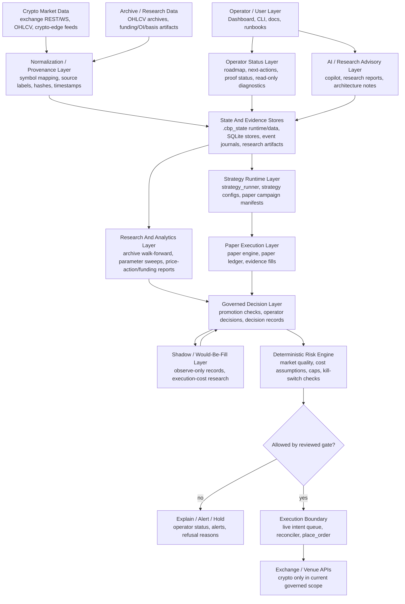

# Current System Diagram

Date: 2026-08-10

## Purpose

This document is a compact current-state map of the repo. It is descriptive,
not authorizing: it does not change campaign behavior, promotion gates, risk
checks, execution routing, broker support, or live-trading authority.

Use it as the starting diagram before adding architecture, strategy, research,
or operator-workflow changes.

## Current Operating Identity

CryptKeep is an evidence-first crypto trading research and operations system.
It has paper/shadow/live progression machinery, but profitability and live
capital reliability are not proven. The BTC/USDT paper gate is one validation
track inside a broader multi-strategy research platform; it is not the full
project identity.

The deterministic trading/risk engine is the only authority allowed to move
capital. AI, research, archive, dashboard, and roadmap layers are advisory
unless a separate reviewed runtime/gate change makes them authoritative.

## System Map

## Current Authority Boundaries

| Layer | Current role | Authority boundary |
|---|---|---|
| Operator/UI | Shows status, runs approved commands, records decisions | Does not become order authority |
| AI/research advisory | Explains, audits, proposes, summarizes | Does not route, submit, cancel, promote, or size capital |
| Research/archive | Produces reproducible artifacts and candidate evidence | Does not change strategy config or campaign behavior without review |
| Strategy runtime | Produces signals and paper/shadow intents | Does not bypass risk gates or final execution boundary |
| Paper/shadow | Measures behavior before live capital | Does not prove profitability by itself |
| Risk engine | Final deterministic gate before capital-moving paths | Must fail closed on invalid or missing safety facts |
| Execution boundary | Owns live intent handling and raw order submission | Capped-live/live changes remain high-risk and separately reviewed |

## Current Multi-Asset Status

| Scope | Current state | Boundary |
|---|---|---|
| Crypto spot/perp research | Supported in research/read-only lanes where configured data exists | Results remain advisory until governed campaign/gate changes |
| BTC/USDT canonical paper gate | Active validation track | Not the project identity and not proof that only BTC can be used |
| Additional crypto paper candidates | Present through existing strategy configs and managed campaign tooling | Must preserve provenance, ownership, risk, and gate policy |
| Stocks/options | Backlog requirements exist, but no governed broker/data/execution scope is active | Read-only research only until requirements, entitlements, margin/assignment, and isolation policy are accepted |

## Near-Term Direction

1. Keep the deterministic risk/execution engine as the sole capital-moving
   authority.
2. Use roadmap, proof-status, and next-action tooling to prevent repeated work
   and reduce operator search time.
3. Keep paper campaigns and research artifacts separate from promotion
   decisions until evidence is reviewed.
4. Advance strategy discovery through archive/research artifacts and already
   supported paper candidates before widening live or broker scope.
5. Treat stock/options and new asset classes as isolated read-only research
   until a separate accepted requirements packet exists.

## Source Documents

- `docs/PROJECT_DIRECTIONAL_PLAN.md`
- `docs/PROJECT_IDENTITY_AND_SCOPE.md`
- `docs/ARCHITECTURE.md`
- `docs/ROADMAP_TRACKING_CHECKLIST.md`
- `docs/BACKLOG_EXECUTION_LANES.md`
- `REMAINING_TASKS.md`
